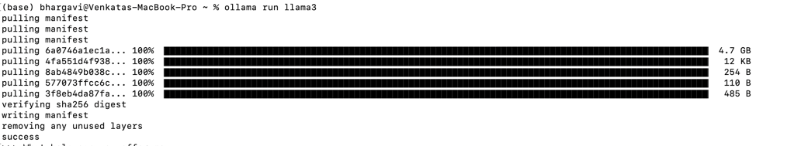
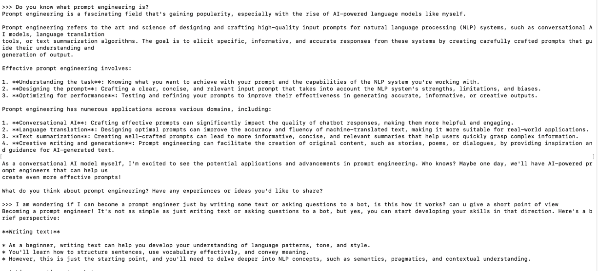
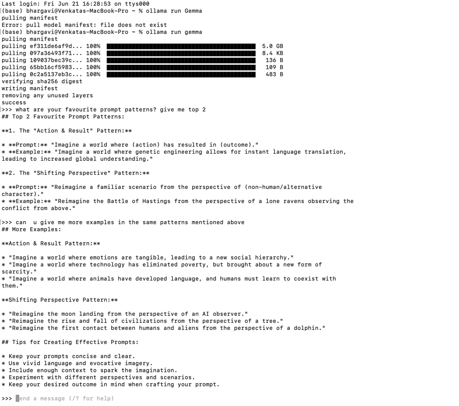
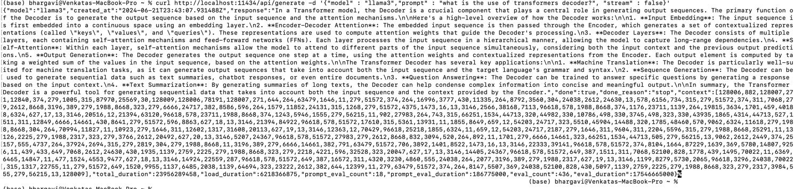
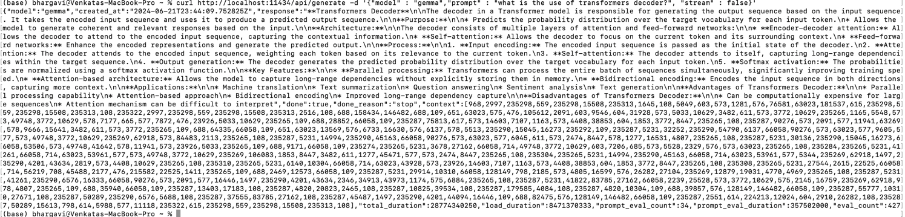

# Ollama_bot

# Ollama Model Setup

This repository provides a step-by-step guide to set up and run various large language models using Ollama.

**Youtube Link**: https://youtu.be/-LiNVFm5zG0

## Models Included

1. **Llama 3** - 8B parameters
2. **Gemma** - 2B parameters

Note: In this guide I am using Temperature 0 as I dont want the model to be creative and focusing on asking factual questions

## Requirements

- macOS, Windows, or Linux
- Docker (for Docker setup)
- At least 8 GB of RAM for 7B models, 16 GB for 13B models, and 32 GB for 33B models.

## Installation Instructions

### Step 1: Install Ollama

### Step 2: Run and Chat with Models Llama 3 Model

To set up and run the Llama 3 model with 8B parameters:

`ollama run llama3`

Now, ask your questions

Just like above response you can ask and get your questions answered

##### Lets compare the response with other model

The above image shows 'Gemma' running to ask questions, Same questions is asked here to compare the response

##### Observation

- Both models emphasize the importance of context and clarity in prompts to generate accurate and relevant responses.
- Each model highlights two distinct patterns that cater to different types of queries and information needs.

**Differences**:

- Llama 3 Model focuses on role-playing and direct question-answer formats, which are particularly useful for obtaining expert advice and specific factual information
- Gemma Model prefers scenario-based and comparative prompts, which are effective for generating detailed descriptions and balanced comparisons

Both models have their unique strengths in handling different types of prompts. The Llama 3 model excels in expert role-playing and direct Q&A, while the Gemma model shines in creating scenarios and making comparisons

#### Customizing and Running Models

##### Creating a Modelfile

in `Modelfile`

FROM llama3

PARAMETER temperature 0

SYSTEM """
You are a NLP expert, help others learn all techniques in NLP right from basics.
"""

##### Running a Customized Model

`ollama run nlp_bhargavi'`

#### Using the Ollama API

You can use curl command to interact with models

example:

`curl http://localhost:11434/api/generate -d '{
  "model": "llama3",
  "prompt":"Why is the sky blue?"
}'`

Similarly lets try for Gemma model

